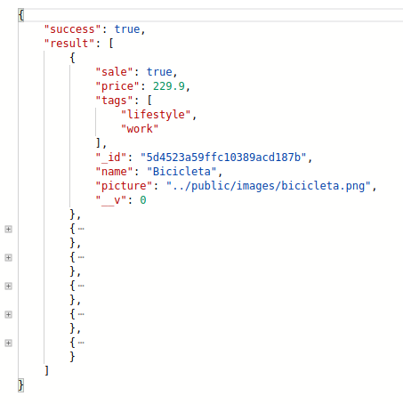
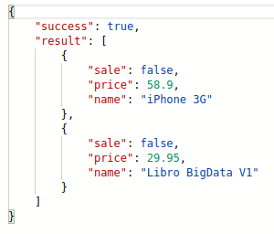
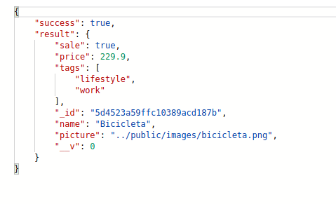
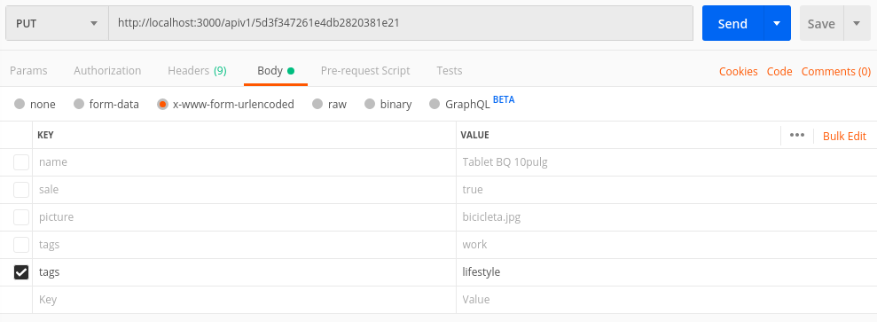
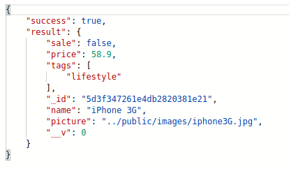
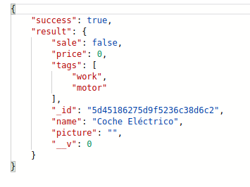
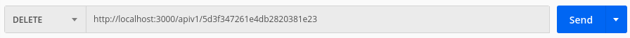
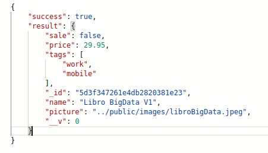
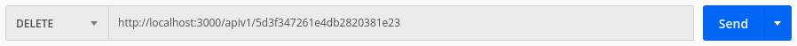
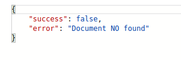

# myShop (<http://localhost:3000>)

## **Autor**
**Santiago San Román** - *Julio 2019*  
[santi72alc@gmail.com](santi72alc@gmail.com)
---
### Índice
- 
  * [Requerimientos de uso](#requerimientos-de-uso)
  * [Inicializando la BD y creando ejemplos](#inicializando-la-bd-y-creando-ejemplos)
  * [API (ver. 1.0) - Diseño de documentos (registros)](#api--ver-10---diseño-de-documentos-registros)
    + [**Diseño del documento** - Modelo Articulo](#--dise-o-del-documento-----modelo-articulo)
  * [API (ver. 1.0) - Métodos de uso](#api--ver-10----m-todos-de-uso)
  * [Documento Artículos](#documento-artículos)
  * [Solicitudes](#solicitudes)
    + [Obtención de TODOS los documentos](#obtenci-n-de-todos-los-documentos)
    + [Obtención de documentos con filtros y/u opciones](#obtenci-n-de-documentos-con-filtros-y-u-opciones)
    + [Obtención de un documento por _id](#obtenci-n-de-un-documento-por--id)
    + [**Modificación de un documento**](#--modificaci-n-de-un-documento--)
    + [**Inserción de un documento**](#--inserci-n-de-un-documento--)
    + [**Borrado de un documento**](#--borrado-de-un-documento--)
  * [Errores en la petición](#errores-en-la-petici-n)
    + [Error en solicitud de consulta, modificación o borrado de un documento](#error-en-solicitud-de-consulta--modificaci-n-o-borrado-de-un-documento)
    + [myShop](#myshop)

<small><i><a href='http://ecotrust-canada.github.io/markdown-toc/'>Table of contents generated with markdown-toc</a></i></small>

---
**IMPORTANTE:** <u>Esta primera versión (*ver.1.0*) de API **SÓLO** hace respuestas de tipo objeto a las peticiones.
</u>
## Requerimientos de uso
Será necesario tener el demonio de MongoDB ejecutado y escuchando peticiones.

Para encender el demonio de mongoDB
<pre>$> mongod --dbpath ~/data/db --directoryperdb</pre>

Con esta instrucción, la BD será creada y leída en el directorio del usuario [`home/data/db`], usando directorios distintos para cada una de las BD existentes.


## Inicializando la BD y creando ejemplos
Para crear la BD y algunos ejemplos
<pre>$> npm run installDB</pre>

Será creada la BD 'shop' y serán añadidos unos cuantos ejemplos a la misma.  
Los ejemplos utilizados son leídos y cargados desde el archivo [./bin/articulos.json](./lib/articles.json).


---
## API (ver. 1.0) - Diseño de documentos (registros)

El driver utilizado para la gestión de la BD es para el gestor MongoDB.  
Esta BD es de las llamadas NO SQL o gestores de documentos. Permite una gestión abierta en cuanto a los registros se refiere.  
No obstante, en esta API se hace un uso 'cerrado' de documento/registro diseñados como 'modelos'.  
Durante este manual se hará referencia a 'documento' como el conocido por otros gestores como registro.

### **Diseño del documento** - Modelo Articulo
<pre>
Articulo = {
            name: {
                type: String,
                required: true
            },
            sale: {
                type: Boolean,
                default: true
            },
            price: {
                type: Number,
                default: 0.0,
                min: 0.0,
                max: 9999.0
            },
            picture: String,
            tags: {
                type: [String],
                enum: ['work', 'lifestyle', 'motor','mobile']
        }
</pre>
Los datos serán grabados en la BD con este diseño de documento.  
Se incluyen algunas 'condiciones y/o validaciones' de los campos en el propio modelo.  

**Tabla de campos:**  (detalles)

| Key/Campo    |   Tipo      |              Condiciones/Validaciones             |  
|:------------:|:-----------:|:---------------------------------------------------|  
| name         | String      | required                                         |  
| sale         | Boolean     | default: true                                     |  
| price        | Number      | min: 0, max: 99999                                   |  
| picture      | String      |                                                   |  
| tags         | [String]    | enum: ['work' , 'lifestile' , 'motor' , 'mobile' ] |  
  
  ---
## API (ver. 1.0) - Métodos de uso
## Documento Artículos

Se documentan a continuación los diferentes métodos que existen para la utilización de esta API.  
A través del uso de estos métodos se facilita un mantenimiento básico (CRUD) de los documentos mediante las peticiones realizadas a la API, así como una consulta detallada a la BD con filtros, límites y otros que se detallan más adelante.

A las peticiones recibidas se les responderá con un objeto con los siguientes datos:

<pre>
object = {
    success:    Boolean,
    result:     Object
}
_success_:  true/false.     Dependiendo del resultado obtenido a la petición.
_result_:   objeto.         Sólo si la petición ha sido existosa. 
                            (Podrá contener los datos de uno o varios documentos,
                            dependiendo de la solicitud realizada)
</pre>

## Solicitudes
### Obtención de TODOS los documentos
>
Permite la obtención general de TODOS los documentos existentes en la BD.  
Devuelve el objeto respuesta y (si 'success' es true) en 'result' habrá un array con los documentos obtenidos.  

Tipo de solicitud: **GET**  
Dirección de solicitud:  
  
Parametros: ninguno.  
Respuesta:  
    * Objeto de respuesta:  
  


### Obtención de documentos con filtros y/u opciones
>
Permite la obtención de documentos haciendo filtración por los campos indicados y devolviendo resultados según las opciones indicadas.
Devuelve el objeto respuesta y (si 'success' es true) en 'result' habrá un array con los documentos obtenidos.  

>
**Filtros**: Es válida cualquier consulta por 'name', 'price', 'sale' o 'tags'.
La consulta se indicará con '?' en la dirección de la petición y a continuación el/los campos a filtrar [http://localhost:3000/apiv1?{campo1="valueCampo1"}{&{campo2="valueCampo2"}}]. Como se indica, la unión de varios campos se debe realizar con el elemento de conjunción '&'.

>
**Opciones**: Las opciones permitidas son:
    <ul>
        <li>*limit*: Máximo de registros de vueltos en la respuesta.</li>
        <li>*skip*: Número de documentos iniciales que NO deseamos que sean devueltos.</li>
        <li>*fields*: Nombre de los campos que serán devueltos en la respuesta ('campo' lo requiere, '-campo' NO lo requiere. Ejemplo: (```?fields=name -price``` devolverá nombre pero NO precio)</li>
        <li>*sort*: Permite que la respuesta sea ordenada por el campo indicado ('campo' ascendente, '-campo' descendente. Ejemplo: (```?sort=-price``` por precio descendiente)</li>
    </ul>

Tipo de solicitud: **GET**
Dirección de solicitud: [http://localhost:3000/apiv1?{{&}filtro}{{&}opciones}]

Ejemplo:  
Solicitud:  
Se solicita los documentos que tengan sale=false y se desea obtener SÓLO los campos *name*, *price* y *sale* pero NO el campo *_id* (el campo *_id* <u>SIEMPRE</u> será devuelto en el objeto si no es indicado lo contrario).
  

    * Objeto de respuesta:  
  

### Obtención de un documento por _id
>
Obtiene el documento identificado por la key ***_id*** solicitado.  
Devuelve el objeto respuesta y (si 'success' es true) en 'result' habrá un objeto con el documento obtenido.  

Tipo de solicitud: **GET**  
Dirección de solicitud: [http://localhost:3000/apiv1/{_id}]  

Ejemplo:  
Solicitud:  
  

    * Objeto de respuesta:  
  

* Esta petición es <u>sólo</u> válida para la búsqueda por el campo '_id'. Para búsquedas más genéricas se recomienda la petición indicada en '<a href="#Obtención de documentos con filtros y/u opciones">Obtención de documentos</a>'

### **Modificación de un documento**
>
Modifica los datos del documento identificado por la key ***_id*** solicitado.  
Los campos a modificar serán pasado por body. SÓLO se verán afectados los campos indicados en la petición.  
Devuelve el objeto respuesta y (si 'success' es true) en 'result' habrá un objeto con el documento ya modificado.  

*__IMPORTANTE__. Las peticiones se realizarán en modo '__urlencoded__'* a través del body  

Tipo de solicitud: **PUT**  
Dirección de solicitud: [http://localhost:3000/apiv1/{_id}]  

Ejemplo:  
Solicitud:  
  
    * Objeto de respuesta:  
  


### **Inserción de un documento**
>
Permite la inserción de un documento en la BD. Los datos de los campos se pasarán por el body de la petición y en codificación 'urlencoded'.
Devuelve el objeto respuesta y (si 'success' es true) en 'result' habrá un array con el documentos guardado.

Tipo de solicitud: **POST**  
Dirección de solicitud: [http://localhost:3000/apiv1/add]  
Parámetros: Objeto modelo 'Articulo' con los datos a través del elemento body de la petición.  

Ejemplo:  
solicitud:  
  
    * Objeto de respuesta:  
  


### **Borrado de un documento**
>
Elimina un documento identificado por la key ***_id*** solicitado.  

Tipo de solicitud: **DELETE**  
Dirección de solicitud: [http://localhost:3000/apiv1/{_id}]  

Ejemplo:  
Solicitud:  
  
    * Objeto de respuesta:  
  

>El objeto obtenido se devuelve a la petición para un posible uso del requiriente pero 
>está borrado de la BD


## Errores en la petición
Cuando se hace una petición a la API y se produce un error, existen varias respuestas por parte de la misma.

### Error en solicitud de consulta, modificación o borrado de un documento
Cuando se hace una solicitud mediante {_id} y es fallida se produce la siguiente respuesta  

Ejemplo:
Solicitud:  
  
    * Objeto de respuesta:  
  


---
### myShop
**Santiago San Román** - *Julio 2019*  
[santi72alc@gmail.com](santi72alc@gmail.com)
